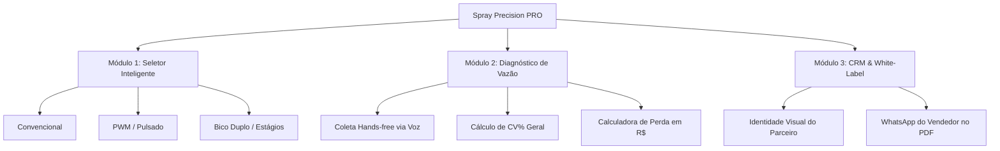

# 🚜 Dossier Executivo & Pitch de Captação — Spray Precision PRO
> **Foco de Destinação**: Editais de Fomento, Finep e Linhas de Inovação do SEBRAE (ex: SebraeTec, Catalisa ICT, Centelha)  
> **Data**: Junho de 2026  
> **Autor**: Eduardo Andrade  

---

## 1. Resumo Executivo (Teaser)
A **Spray Precision PRO** é uma startup de AgriTech (SaaS) que digitaliza a calibração e a aferição de pulverizadores agrícolas. Nossa tecnologia soluciona um gargalo invisível no campo: o desgaste e a escolha errônea de pontas de pulverização (bicos), responsáveis pelo desperdício de até 15% dos defensivos agrícolas aplicados no Brasil. Unimos um **Simulador Inteligente de Pontas** (com suporte a sistemas avançados como PWM e Bico Duplo em estágios) e um **Diagnóstico Hidráulico de Campo via Voz Hands-free** em um aplicativo PWA offline-first de alta conversão, operando com margem líquida de SaaS de 70% e com modelo de distribuição híbrido (B2B White-Label para revendas e SaaS B2C para agrônomos).

---

## 2. O Problema de Mercado
A pulverização de defensivos (herbicidas, fungicidas e inseticidas) representa, em média, **30% do custo operacional de produção de grãos** (soja, milho e algodão). Apesar da criticidade dessa etapa, o mercado enfrenta duas grandes dores:

1. **Desgaste Imperceptível**: As pontas de pulverização sofrem abrasão contínua devido aos produtos químicos e à suspensão de argila na água. O aumento milimétrico do orifício do bico é invisível a olho nu, mas eleva a vazão real muito além da taxa recomendada pelo fabricante.
2. **Recomendação Errônea / Falta de Dados**: A escolha do bico ideal para diferentes condições de vento, umidade, velocidade e tecnologia do pulverizador (como sistemas pulsados PWM ou de Bico Duplo sequencial) é feita por tentativa e erro ou baseando-se em catálogos de papel complexos.

### Consequências Agronômicas e Ambientais:
* **Subdosagem**: Aplicação abaixo do recomendado, resultando em falha no controle de pragas/doenças e acelerando a **resistência biológica** de plantas daninhas e fungos.
* **Sobredosagem**: Fitoxicidade (queima da cultura comercial), escoamento de calda para o solo e contaminação de lençóis freáticos.
* **Deriva Severa**: Geração de gotas excessivamente finas que evaporam ou são levadas pelo vento para áreas vizinhas, gerando ineficiência e passivos ambientais.

---

## 3. O Prejuízo Financeiro Quantificado (A Dor)
Para um produtor rural de grãos de médio porte no Brasil, os números do desperdício são alarmantes. Abaixo apresentamos o cálculo do prejuízo direto causado por uma barra de pulverização operando com apenas 10% de desgaste médio nos bicos:

### Cenário de Referência:
* **Propriedade**: 1 fazenda de 1.000 hectares (soja + milho safrinha).
* **Custo Médio de Defensivos por Hectare (Safra + Safrinha)**: R$ 1.200,00.
* **Investimento Total Anual em Químicos**: R$ 1.200.000,00.
* **Desvio Médio de Vazão por Bico Desgastado**: +10% (acima do limite máximo tolerado de 10% pela norma ISO 10625).

### Cálculo das Perdas Anuais Directas:
| Categoria de Desperdício | Cálculo Base | Perda Estimada (Anual) |
|---|---|---|
| **Desperdício Direto de Calda** | 10% de excesso aplicado desnecessariamente | R$ 120.000,00 |
| **Perda por Fitotoxicidade/Subdosagem** | Redução de apenas 1,5 sc/ha na soja (a R$ 120/sc) | R$ 180.000,00 |
| **Desgaste Prematuro de Bomba/Componentes** | Pressão excessiva para compensar desvios | R$ 15.000,00 |
| **Total de Perda Invisível** | **Prejuízo financeiro anual por fazenda** | **R$ 315.000,00** |

> [!WARNING]
> **O Paradoxo do Balcão**: O produtor prefere perder R$ 315.000,00 de calda no solo do que gastar R$ 8.000,00 para substituir um jogo completo de bicos de cerâmica da máquina. A nossa solução quebra esse paradoxo ao **tangibilizar em tempo real** o desperdício em Reais na tela do celular do produtor rural.

---

## 4. A Solução: Spray Precision PRO
Nossa plataforma é estruturada como um ecossistema digital integrado, de funcionamento offline-first (PWA), focado em resolver a dor na tomada de decisão (no balcão) e no diagnóstico de falhas (no campo).



### Diferenciais Tecnológicos:
1. **Seletor de Bico Multitecnologia (PWA)**:
   * **Modo Convencional**: Seleção automática de pontas ISO com menor desvio de pressão nominal.
   * **Modo PWM (Pulsado)**: Calcula o ciclo de trabalho (Duty Cycle) ideal nas velocidades limites para manter a pressão da calda estável.
   * **Modo Bico Duplo**: Lógica layman-friendly para transição automática de estágios (A, B e A+B), calculando sobreposições seguras e acusando lacunas críticas de pressão.
2. **Aferidor de Vazão Inteligente**:
   * **Voz Hands-Free**: O técnico dita os volumes em mililitros enquanto segura a proveta sob o bico. O aplicativo processa a fala localmente (offline) por reconhecimento de fala, eliminando o papel molhado e a necessidade de digitar com as mãos sujas.
   * **Gráfico de Barra Espacial**: Mapeamento cromático instantâneo da barra (Verde: OK | Amarelo: Alerta | Vermelho: Substituir).
   * **Laudo PDF Whitelabel**: O relatório é emitido em segundos com os dados da máquina, gráfico de barra e a logomarca da cooperativa ou revenda que realizou o atendimento, vinculando o contato de WhatsApp do vendedor.

---

## 5. Dimensionamento de Mercado (TAM, SAM, SOM)
O agronegócio brasileiro é gigante e a demanda por otimização de custos e sustentabilidade cresce a taxas de dois dígitos.

```
+-------------------------------------------------------+
| TAM: Mercado Total Acessível (Brasil)                  |
| 1.000.000 de propriedades profissionais = R$ 645M/ano  |
|                                                       |
|   +-------------------------------------------------+ |
|   | SAM: Mercado Endereçável (Top 5 Estados)         | |
|   | 40.000 consultores + 8.000 lojas = R$ 48M/ano    | |
|   |                                                 | |
|   |   +-------------------------------------------+ | |
|   |   | SOM: Mercado Focado (Metas Ano 3)         | | |
|   |   | 3.000 cons. + 500 lojas = R$ 3,3M/ano ARR | | |
|   |   +-------------------------------------------+ | |
|   +-------------------------------------------------+ |
+-------------------------------------------------------+
```

* **TAM (Total Addressable Market)**:
  * Foco: Todas as propriedades de médio/grande porte com pulverizadores de barra e agronomistas/consultores no Brasil.
  * Base: 1.000.000 de fazendas profissionais + 15.000 filiais de revendas/cooperativas agrícolas.
  * **Valor Estimado**: **R$ 645.000.000,00 / ano**.
* **SAM (Serviceable Addressable Market)**:
  * Foco: Regiões de alta tecnologia de aplicação (Centro-Oeste e Sul do país - MT, PR, RS, GO, MS).
  * Base: 40.000 consultores técnicos independentes + 8.000 lojas/revendas de insumos com venda de pontas.
  * **Valor Estimado**: (40.000 consultores * R$ 600/ano) + (8.000 revendas * R$ 3.000/ano) = **R$ 48.000.000,00 / ano**.
* **SOM (Serviceable Obtainable Market)**:
  * Foco: Nossa meta realista de captação de clientes em 3 anos, utilizando vendas B2B diretas e canais de marketing digital focados.
  * Base: 3.000 consultores ativos (7,5% do SAM de consultores) + 500 lojas parceiras (6,25% do SAM de revendas).
  * **Valor Estimado**: (3.000 * R$ 600/ano) + (500 * R$ 3.000/ano) = **R$ 3.300.000,00 ARR** (Faturamento Recorrente Anual).

---

## 6. Funil de Vendas e Aquisição Realista
A Spray Precision PRO utiliza um funil de duas frentes de aquisição (B2C para consultores e B2B para revendas) altamente otimizado por canais digitais segmentados.

```
       [20.000 Leads] ➔ Visitantes de landing pages (Meta/Google Ads)
             │
             ▼
       [2.000 Trials] ➔ Cadastros de teste grátis (Conversão: 10%)
             │
             ▼
        [500 SaaS]   ➔ Consultores individuais pagantes (Conversão: 25%)
             +
       [80 Revendas] ➔ Lojas B2B White-Label ativas (Vendas diretas)
```

### Estratégia de Captação:
* **Canais Online (B2C)**: Tráfego pago no Instagram/Facebook segmentado por localização (cidades polos do Agro) e interesses ("Agronomia", "Fitossanidade"). Gancho principal: *"Mostre ao seu cliente quanto dinheiro ele está jogando fora com bicos desgastados"*.
* **Canais Diretos (B2B)**: Prospecção ativa (Inside Sales) de diretores de marketing e compras de redes de revendas de insumos (como Lojas John Deere, Jacto e revendas multimarcas de defensivos). O benefício ofertado é a ferramenta de balcão personalizada para alavancar a venda de pontas de pulverização físicas.

---

## 7. Prospecção Financeira e DRE Simplificada
Graças à infraestrutura escalável e centralizada no Supabase e Vercel, o custo marginal de atendimento de novos usuários é extremamente baixo, permitindo alta lucratividade.

### DRE Projetada (Anos 1 a 3):

| Item | Ano 1 | Ano 2 | Ano 3 |
|---|---|---|---|
| **Clientes Ativos (SaaS Individual)** | 500 | 1.500 | 3.000 |
| **Clientes Ativos (Revendas B2B)** | 80 | 250 | 500 |
| **Faturamento Anual Recorrente (ARR)**| **R$ 540.000,00** | **R$ 1.650.000,00** | **R$ 3.300.000,00** |
| Custo de Infraestrutura (Nuvem, APIs) | R$ 36.000,00 | R$ 90.000,00 | R$ 180.000,00 |
| Custo Comercial & Tráfego Pago | R$ 80.000,00 | R$ 200.000,00 | R$ 360.000,00 |
| Pessoal (Engenharia + Suporte) | R$ 64.000,00 | R$ 190.000,00 | R$ 360.000,00 |
| **Custo Operacional Total (OPEX)** | **R$ 180.000,00** | **R$ 480.000,00** | **R$ 900.000,00** |
| **EBITDA (Margem EBITDA)** | **R$ 360.000,00 (66%)**| **R$ 1.170.000,00 (70%)**| **R$ 2.400.000,00 (72%)**|

---

## 8. Valuation da Startup & Solicitação SEBRAE

### Metodologia de Valuation:
Considerando que a startup é um modelo de software como serviço (SaaS) escalável com propriedade intelectual proprietária, o método mais indicado para avaliação em estágio inicial (Pre-Seed) é o de **Múltiplo de ARR (Annual Recurring Revenue)** do Ano 1.
* Múltiplo padrão de mercado para SaaS early-stage com crescimento acelerado: **5x ARR**.
* ARR do Ano 1 Projetado: **R$ 540.000,00**.
* **Valuation Pré-Money Estimado**: **R$ 2.700.000,00**.

### Solicitação de Recursos ao SEBRAE / FINEP:
Buscamos uma captação de **R$ 250.000,00** (via editais de subvenção não-dilutiva ou coinvestimento anjo em rodada de inovação aberta). 

### Destinação dos Recursos:
* **50% — P&D e Engenharia**: Integração final de APIs de satélite para mapeamento de talhões e aprimoramento do motor de reconhecimento de voz hands-free local.
* **30% — Comercial e Marketing**: Investimento estruturado em tráfego pago de conversão e material de campo para venda B2B direta a cooperativas agrícolas.
* **20% — Operações e Suporte**: Estruturação do time de Customer Success e servidores de alta escalabilidade.

---

## 9. Roteiro do Slide Deck (Apresentação de 3 a 5 Minutos)

Abaixo estruturamos a sequência de slides ideal para a defesa oral perante a banca avaliadora do SEBRAE.

### Slide 1: Capa & Propósito
* **Visual**: Logotipo da Spray Precision PRO em alta definição com fundo escuro e foto de um pulverizador em ação.
* **Texto de Destaque**: *"Spray Precision PRO: Digitalizando a aplicação agrícola para combater o desperdício invisível."*
* **Foco do Pitch**: Apresentar-se e fisgar a atenção apontando para o agro tecnológico brasileiro.

### Slide 2: O Problema (O Ralo de Dinheiro)
* **Visual**: Foto de um bico desgastado vazando jatos tortos contraposta com um bico novo. Tabela de perdas financeiras (R$ 315.000 perdidos/ano por fazenda).
* **Texto de Destaque**: *"Defensivos são 30% do custo da fazenda, mas 15% são perdidos no solo devido a bicos desgastados ou mal regulados."*
* **Foco do Pitch**: Gerar desconforto na banca provando que o desperdício não é por falta de defensivo, mas por ineficiência hidráulica do maquinário.

### Slide 3: A Solução (O App de Campo)
* **Visual**: Mockup de celular exibindo as telas do app: Seletor Inteligente com PWM/Bico Duplo e o gráfico de barra espacial do diagnóstico hidráulico.
* **Texto de Destaque**: *"A tecnologia na mão do produtor: Seleção automatizada, aferição sem as mãos via Voz e relatórios instantâneos."*
* **Foco do Pitch**: Demonstrar a facilidade do uso (PWA offline, comando por voz) e o valor agregado do relatório whitelabel.

### Slide 4: O Mercado (TAM/SAM/SOM)
* **Visual**: Gráfico de círculos concêntricos ilustrando o TAM (R$ 645M), SAM (R$ 48M) e SOM (R$ 3,3M ARR).
* **Texto de Destaque**: *"Um mercado endereçável de R$ 48 milhões ao ano nos principais polos de grãos do Brasil."*
* **Foco do Pitch**: Provar que o mercado de vendas de bicos e serviços de calibragem no agronegócio é massivo e escalável.

### Slide 5: Tração e Modelo de Negócios
* **Visual**: Ilustração das duas frentes comerciais (Assinatura Individual PRO a R$ 49,90 e Licença Revenda White-Label a R$ 250,00). 
* **Texto de Destaque**: *"Dupla via de receita: Vendas recorrentes para agrônomos independentes e contratos corporativos com lojas de insumos."*
* **Foco do Pitch**: Mostrar que a startup já possui uma estrutura tarifária clara e planos comerciais definidos.

### Slide 6: Projeções Financeiras e DRE
* **Visual**: Gráfico de colunas ilustrando a evolução do ARR ao longo dos 3 anos (R$ 540k ➔ R$ 1,65M ➔ R$ 3,3M) e as margens EBITDA sustentáveis de 70%.
* **Texto de Destaque**: *"Crescimento previsível e escalável com margem líquida operacional de 70%."*
* **Foco do Pitch**: Demonstrar que o negócio é financeiramente saudável e tem baixo custo marginal de suporte.

### Slide 7: A Equipe e a Solicitação (O Fechamento)
* **Visual**: Fotos dos fundadores com suas competências (Engenharia Agronômica, Desenvolvimento de Software e Gestão Comercial).
* **Texto de Destaque**: *"Buscamos R$ 250.000,00 para impulsionar a engenharia do produto e acelerar a comercialização B2B no Centro-Oeste."*
* **Foco do Pitch**: Finalizar com credibilidade técnica do time e definir como os recursos do edital catalisarão o crescimento do negócio.
